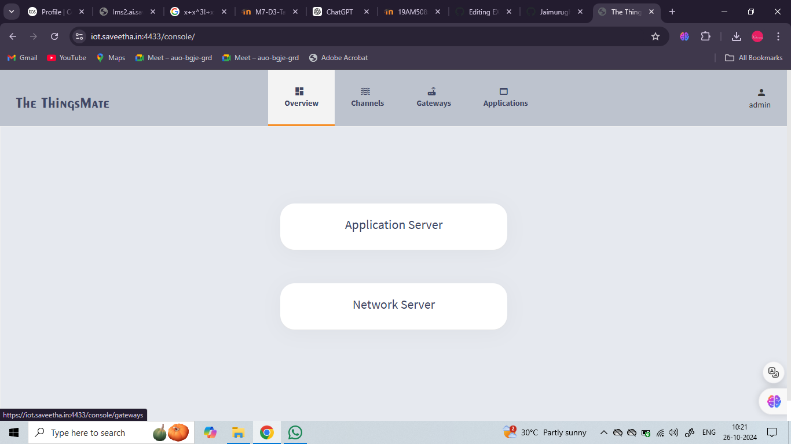
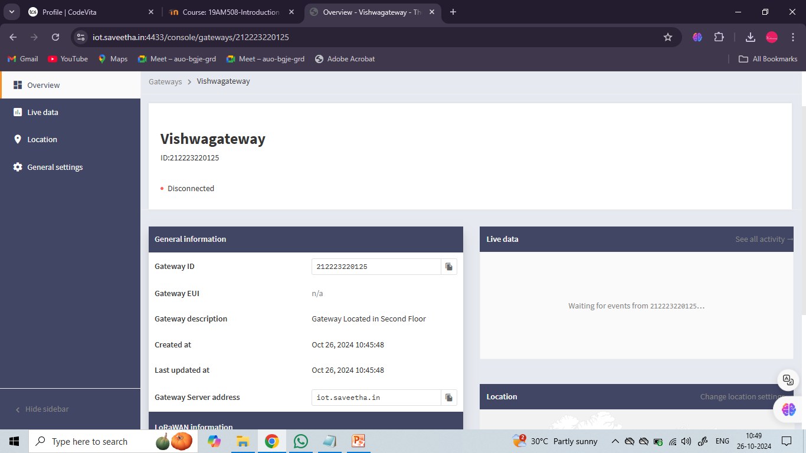
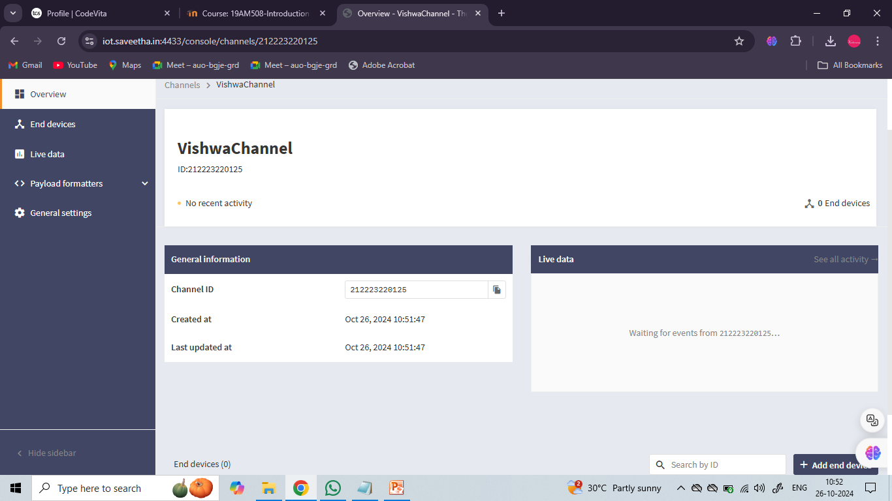
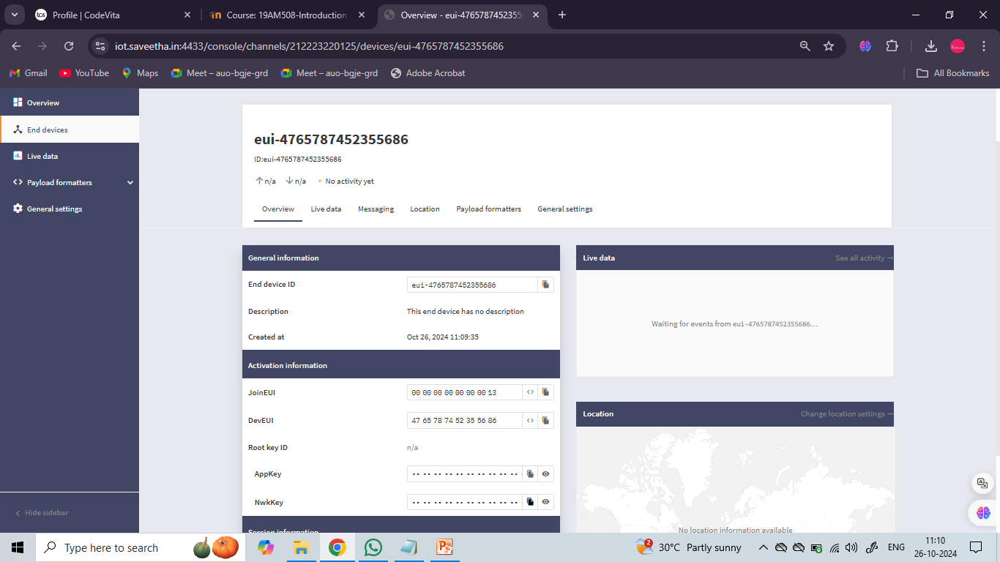
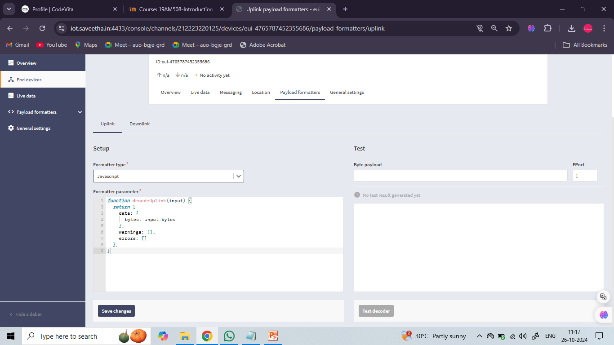

 ### EXPERIMENT -07 CONFIGURING NETWORK SERVER FOR CONNECTING GATEWAY AND END NODE 
 
## Aim: 
To  configure  the Network server and end device for traferring data on the network
## Components required: 
end node stm 32 development kit , dragino LPS8, network server 

## Theory :
When working with sensitive applications or files, saving progress on your local device is a start, but what if you lose access to your device? Network servers address this problem by hosting the files and programs most pertinent to the network and enabling access for consistent, real-time use. 

As a result, personnel or network clients can instantly access important data or tools while also facilitating collaboration between users. Multiple users can make changes to the same program or document for continued development over the course of a project. Via a secure login, remote users can connect to the home network.

In the above graphic, the circle represents an organization network where a network server facilitates collaboration and file sharing between network clients (devices).

 The role of a network server, then, is to provide users with a set of services and access to resources on the network. These features include:

Permissioned access and log-ins for network users Gateway access to the Internet for an organization Centralized location for network resources  Shared access to devices on the network like a printer or a scanner Hosts multi-user apps like email servers, web applications, or CRM

## Procedure :

 1. login to the network server using login link  https://iot.saveetha.in/
 2. Click on the nework server as shown blow 
 
 3. click on the add gateway 
 

4. click on the lora options , lora - frequency plan 
5. click on channel s and create a new channel after which you can add a new end device 

6. add the attributesin the end device as  shown below 
 
7.using AT commands configure end device in serial port utility
AT Commands to set initially (Mandatory)
 AT+FDR // To do factory data reset
 AT+NJM=1 // To set OTAA mode
 AT+ADR=1 // To enable the ADR
 AT+TDC=600000 // To set the default sampling interval as 10 minutes
(Should not give below 5 minutes)
 AT+CLASS=C // To set class C
 AT+DEUI=XX XX XX XX XX XX XX XX // To set Device EUI key
 AT+APPEUI=XX XX XX XX XX XX XX XX // To set APP EUI key
 AT+APPEUI=XX XX XX XX XX XX XX XX XX XX XX XX XX XX XX XX //
To set APP Key
 ATZ // To take effective action on below settings (As like saving)

## OUTPUT 
1. iot.saveetha.in Website Dashboard

2. Gateway Dashboard

3. Channel Dashboard

4. End Device Dashboard

5. Payload Formatter

## Result: 

  The Network server and end device for traferring data on the network has been accomplished.

